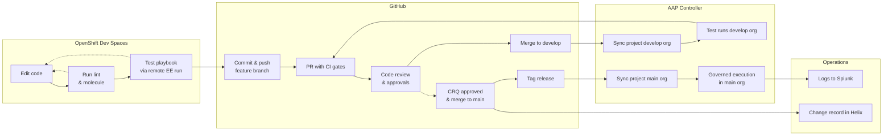
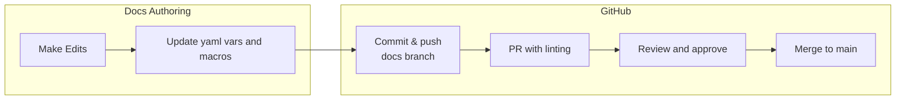

# 🚀 SEO Automation Framework Documentation

Welcome to the **SEO Automation Framework Docs** repository — a living collection of our **patterns, standards, and reusable assets** for building and governing automation at scale.  
This repository represents the technical implementation layer of our broader automation strategy and aligns directly with our SharePoint “Automation Hub” pages for strategic and approval documentation.

## Quick Links

- [Document Directory](#documents)
- [SEO Leaderships Strategic Phases](#strategic-phases)

---

## Purpose

This repository serves as the **single source of truth** for:

- Development lifecycle standards (Ansible, Dev Spaces, Execution Environments)
- Architecture & governance frameworks (AAP, CI/CD, code promotion)
- Integration patterns (VMware, Satellite, MECM, Splunk, BMC Helix)
- Shared automation OKRs and performance metrics
- Example playbooks, templates, and configuration references

Together, these artifacts support our organizational goals to:

1. **Accelerate efficiency** by reducing manual effort.  
2. **Improve reliability** through standardized automation.  
3. **Enable innovation** by freeing engineers to focus on high-value work.  
4. **Foster continuous improvement** by embedding automation into daily operations.

---

## Strategic Phases

All automation initiatives and documentation follow the **SEO four-phase implementation model**:

| Phase | Description | Example Deliverables |
|------------|---------------|----------------------|
| **Discovery** | Identify automation candidates, collect data, assess feasibility. | Intake Form, Process Map, Discovery Notes |
| **Pilot** | Build prototype workflows, validate standards, measure initial impact. | Pilot Playbook, CI Config, Test Report |
| **Scale** | Extend automation across teams, integrate with governance and monitoring. | Reusable Roles, Shared Collections, AAP Workflow Templates |
| **Institutionalize** | Embed automation in day-to-day operations and maintenance. | Governance Updates, Training Docs, Audit Reports |

---

## How to Use This Repo

| Area | Description |
|------|--------------|
| **Governance Docs** | Defines AAP policy, RBAC models, and compliance standards. |
| **Developer Guidance** | Sets code style, documentation structure, and branching strategy. |
| **Runbooks** | Step-by-step operational automation guides (linked to Teams/Server Ops). |
| **Reference & Troubleshooting** | Technical patterns and configuration guides. |
| **Strategy & Intake** | Templates for proposing and tracking new automation work. |

> All Markdown documents can be rendered to **HTML, PDF, or DOCX** using manually via VSC or via Pandoc/MkDocs pipelines in the future.

---

## Documents

| Doc Topic | Description | |
|---------------|------------------------|---------------------------------------------|
| Code Style     | [`code-style-guide.md`](docs/02-Developer-Guidance/code-style-guide.md) | YAML, naming, linting, and documentation standards. |
| Documentation  | [`documentation-structure-guide.md`](docs/02-Developer-Guidance/documentation-structure-guide.md)       | Defines folder layout and authoring conventions.    |
| Branching      | [`branching-strategy-guide.md`](docs/02-Developer-Guidance/branching-strategy-guide.md)                 | Git strategy and CRQ linkage process.               |
| Templates      | [`workflow-and-job-template-naming.md`](docs/02-Developer-Guidance/workflow-and-job-template-naming.md) | AAP job and workflow naming standards.              |
| Change Control | [`crq-and-promotion-checklist.md`](docs/02-Developer-Guidance/crq-and-promotion-checklist.md)           | Required steps for production promotion.            |

---

## Repository Structure

```bash
docs/
01-Governance/ # Policy, RBAC, security & compliance frameworks
02-Developer-Guidance/ # Code style, branching, and naming conventions
03-Runbooks/ # Approved runbooks for operational execution
04-Reference/ # Integration patterns, API docs, troubleshooting
05-Strategy-Intake/ # Discovery & intake forms for new automation requests
macros/ # Jinja2 macros for Pandoc/templating
vars/ # YAML variable files used in documentation rendering
examples/ # Playbooks, CI snippets, and EE build templates
diagrams/ # Mermaid diagrams and sequence flows
site/ # Generated output for MkDocs or SharePoint publishing
```

**SharePoint Integration:**  

> The SharePoint “Automation Hub” hosts strategic, approval, and intake documents — each linking back here for technical implementation details.

---

Links to documents around our major development workflows.

### Ansible code development workflow



> insert link here

### Documentation code workflow



> insert link here

### Image build pipeline workflow

```mermaid
flowchart LR
  subgraph DevSpaces[OpenShift Dev Spaces]
    A[Edit ee config<br>& containerfile]
    B[Trigger build task]
  end

  subgraph Build[Builder Host or Shipwright]
    C[ansible builder or buildah build]
    D[Run sbom and vuln scan]
    E[Sign image with cosign]
  end

  subgraph Registry[Quay or Private Automation Hub]
    F[Push image]
    G[Mark as approved]
  end

  subgraph AAP[AAP Controller]
    H[Pull image to develop org]
    I[Test jobs in develop]
    J[CRQ approve promote]
    K[Pull image to main org]
  end

  subgraph Observability[Operations]
    L[Logs and metrics to Splunk]
  end

  A --> B --> C --> D --> E --> F --> G --> H --> I --> J --> K --> L

```



> insert link here
